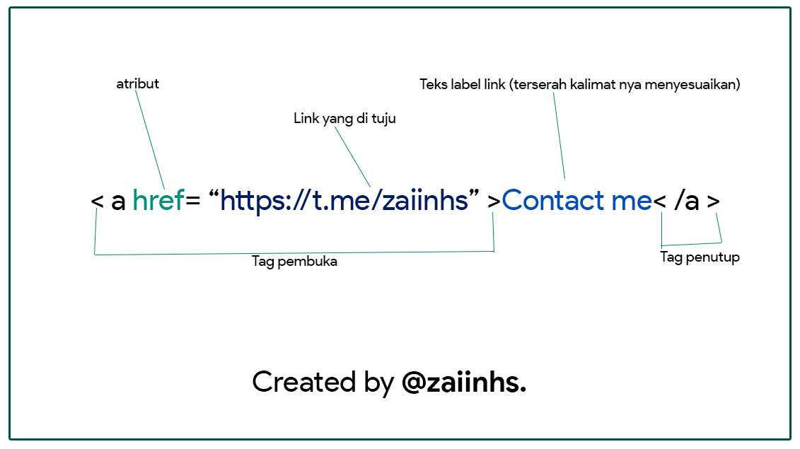
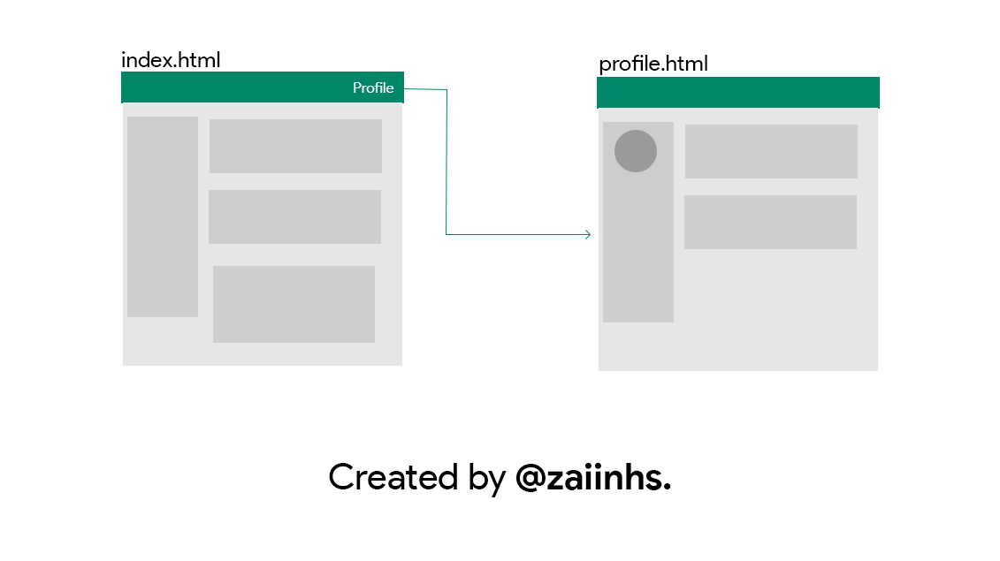

<h1 align="center">LINK HTML</h1>
 

## Apa itu Link di HTML ?

`Link` atau `Hyperlink` adalah elemen HTML yang berfungsi menghubungkan suatu halaman web ke halaman web yang lain nya.

Tidak hanya untuk menghubungkan halaman, link juga berfungsi sebagai scroll top, download file, menjalankan fungsi javascript, dll.

## Bagaimana membuat link di HTML ?

Link pada HTML dapat dibuat dengan tag `<a>`, kemudian tag ini harus memiliki atribut `href` untuk memasukkan alamat URL yang dituju.

<b>Contoh:</b>

## Jenis-jenis Link pada HTML

- <b>Internal Link</b>
  `Internal link` adalah link yang dipergunakan untuk menuju ke domain atau halaman web itu sendiri.
  
- <b>Ekternal Link</b>
  `Ekternal Link` adalah jenis link yang mengarah ke domain lain nya. Seperti mencantum _<b>social media</b>_ kita di website yang akan dibuat.

 
#### Mungkin cukup sekian dulu, tunggu di part selanjutnya yak 😊
 

Created by <a href="https://github.com/zaiinhs"><b>@zaiinhs.</b></a>

