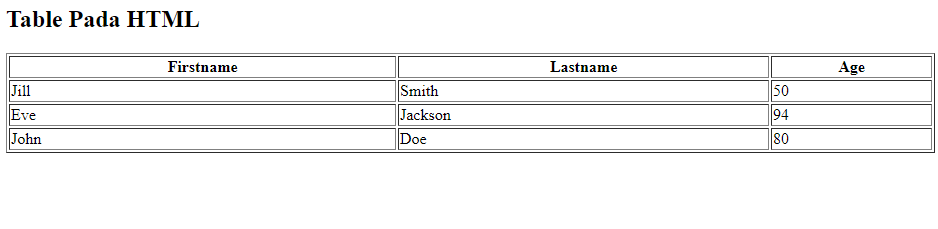

<h1 align="center">TABLE pada HTML</h1>
<br>

## Cara mendefinisikan Table di HTML ?

Ketika kita hendak mendefinikan table pada HTML tag yang digunakan yakni `<table>`. Setiap baris tabel didefinisikan dengan tag `<tr>`. Setiap header tabel didefinisikan dengan tag `<th>`. Setiap data tabel / sel didefinisikan dengan tag `<td>`.

Secara default, teks dalam elemen `<th>` dicetak tebal dan di tengah.

Secara default, teks dalam elemen `<td>` beraturan dan rata kiri.

Langsung kita praktekkan yuk 😊

- Petama tama jangan lupa buat file project kita dengan bereksstensi <b>.html</b> dan buka di code editor favorit kalian
- Ikuti code dibawah ini :

```
<!DOCTYPE html>
<html>
<body>

<h2>Table Pada HTML</h2>

<table style="width:100%" border="1">
  <tr>
    <th>Firstname</th>
    <th>Lastname</th> 
    <th>Age</th>
  </tr>
  <tr>
    <td>Jill</td>
    <td>Smith</td>
    <td>50</td>
  </tr>
  <tr>
    <td>Eve</td>
    <td>Jackson</td>
    <td>94</td>
  </tr>
  <tr>
    <td>John</td>
    <td>Doe</td>
    <td>80</td>
  </tr>
</table>

</body>
</html>

```
- Save it dan kita buka file project kita di browser



# Yeah you did it 🎉🎉🎉

Mungkin cukup sekian dulu, stay tune yah...


<P align="center">Created by <a href="https://github.com/asuna199"><b>@asuna199.</b></a></p>
