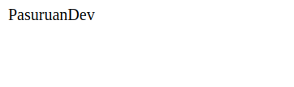
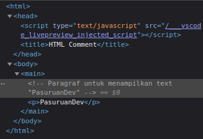

# HTML Comment

Comment biasanya berfungsi sebagai catatan kecil yang menjelaskan kode yang kita tulis. Comment akan diabaikan dan tidak dibaca oleh komputer saat programnya dijalankan atau di running.

HTML comment diawali dengan ```<!--``` dan diakhiri dengan ```-->```.

**Sebagai contoh :**

```HTML
<html>
  <head>
    <title>HTML Comment</title>
  </head>
  <body>
    <main>
      <!-- Paragraf untuk menampilkan text "PasuruanDev" -->
      <p>PasuruanDev</p>
    </main>
  </body>
</html>
```

Jika dijalankan, hasilnya akan terlihat seperti ini di browser:



Namun, dibelakang layar comment kita akan tetap terlihat pada source code



Bukan hanya sebagai catatan kecil saja, comment biasanya juga berguna untuk menghilangkan sebuah element untuk sementara yang kemungkinan akan kita tampilkan lagi nantinya. Daripada kita menghapusnya, lebih baik jika kita manfaatkan saja comment ini.

**Contohnya seperti :**

```HTML
<!DOCTYPE html>
<html>
  <head>
    <title>HTML Commnet</title>
  </head>
  <body>
    <!-- <h1>Hello World!<h1>  -->
    <p> Halo semua... Selamat Datang di PasuruanDev!</p>
  </body>
</html>
```

Pada code editor seperti VSCode biasanya terdapat shortcut untuk mempercepat penggunaan comment dengan menggunakan ```ctrl + /``` pada baris yang akan di comment


# Penjumlahan pada Python

Python dapat kita gunakan sebagai kalkulator sederhana dengan menggunakan :

- operator + untuk penjumlahan
- operator - untuk pengurangan
- operator * untuk perkalian
- operator / untuk pembagian

tanda kurung () dapat digunakan untuk pengelompokan

Sebagai contoh:

```
>>> 2 + 2
4
>>> 50 - 5*6
20
>>> (50 - 5*6) / 4
5.0
>>> 8 / 5  # pembagian selalu mengembalikan angka dengan tipe float
1.6
```


setelah kita memahami operator pada bahasa pemrograman python, mari kita implementasikan dengan membuat program sederhana sesuai apa yang sudah kita pelajari pada materi sebelumnya.

kita akan membuat program sederhana penjumlahan dua angka, dengan mengimplementasikan fungsi input untuk menerima inputan dari user.

karena fungsi input akan menyimpan data denga tipe data string, maka dari itu kita harus mengkonversi data(string) tersebut menjadi integer dengan menggunakan fungsi int().

setelah itu kita buat variabel jumlah untuk menjumlahkan dua angka yang di inputkan oleh user.

**Contoh program:**

```python
# Memasukkan Inputan Angka
angka1 = input('Masukkan angka pertama: ')
angka2 = input('Masukkan angka kedua: ')

# Mengkonversi Angka lalu Menjumlahkannya
jumlah = int(angka1) + int(angka2)
 
# Menampilkan Hasil Penjumlahan
print('Hasil Penjumlahan {0} dan {1} adalah {2}'.format(angka1, angka2, jumlah))
```

atau bisa menggunakan cara di bawah ini

```python
# Memasukkan Inputan Angka sekaligus mengkonversi
angka1 = int(input('Masukkan angka pertama: '))
angka2 = int(input('Masukkan angka kedua: '))

# Menjumlahkan
jumlah = angka1 + angka2

# Menampilkan Hasil Penjumlahan dengan cara yang lain
print(f'Hasil Penjumlahan {angka1} dan {angka2} adalah {jumlah}')
```

Jika dijalankan, hasilnya kurang lebih akan seperti ini:

```
Masukkan angka pertama: 1
Masukkan angka kedua: 12
Hasil Penjumlahan 1 dan 12 adalah 13
```
