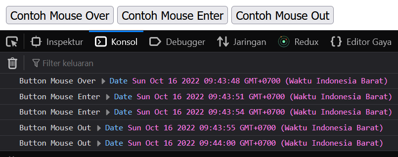

## Events
---
**Event-Driven Programming** adalah salah satu teknik pemograman, yang konsep kerjanya tergantung dari kejadian atau event tertentu. Salah satu bahasa pemrograman yang mendukung **Event-Driven** ini adalah **JavaScript**

**Apa itu Events ?**<br />
**Events** adalah suatu peristiwa / kejadian yang ada di halaman web <br />

**Contoh Events :**<br />
- Event Click : Ketika mengklik suatu element HTML
- Event Scroll : Ketika user melakukan scrolling
- Event Submit : Ketika user menekan button submit form<br />
Dan masih banyak lagi

### Bagaimana cara menghandle event di javascript ?
#### :crown: 1. Menggunakan Attribute Element
Kita bisa menggunakan attribute **onClick** di element button untuk menjalankan suatu fungsi ketika di klik.
Dan ketika kita menekan button submit, kita bisa menjalankan fungsi untuk melakukan sesuatu.

Bisa saja kita buat seperti ini :
```html
<button onClick="tampilPesan()">Klik disini</button>
```
Untuk isi fungsi nya bisa kita isi apapun sesuai kebutuhan kita, for example fungsi nya menampilkan alert `Hello World from JavaScript Event`
```js
function tampilPesan() {
    alert("Hello World from JavaScript Event")
}
```
Dengan begitu, ketika kita memberikan suatu event click pada button, otomatis browser akan menampilkan alert tampilPesan tersebut

#### :crown: 2. Menggunakan method addEventListener
addEventListener adalah suatu method yang ada di dalam Object DOM ( Document Object Model ), yang bisa mewakili suatu element seperti button, div dll di Javascript
Contoh nya, kita pakai button yang sebelumnya dan kita remove attribute onClick nya, jadi seperti ini
```html
<button>Klik disini</button>
```
Kemudian kita coba pakai addEventListener untuk handle event click di button untuk menjalankan suatu fungsi yang sama seperti diatas, kita bisa tulis seperti ini
```js
// onClick ❌ ( Penulisan tidak tepat )
button.addEventListener("onClick", function() {
    alert("Hello World from JavaScript Event")
})
```
```js
// click ✅ ( Penulisan tepat )
button.addEventListener("click", function() {
    alert("Hello World from JavaScript Event")
})
```
Kalau kita memakai parameter `e` atau `event` seperti ini
```js
button.addEventListener("click", function(event) {
    console.log(event)
})
```
kita bisa akses `Object Event` yang mengirim event yaitu button, dengan begitu, kita bisa melakukan apapun dengan Object tersebut.

Itu tadi contoh untuk event Click. Tidak cuma itu, kita akan coba beberapa event lagi yang sebagian umum digunakan

👑 **Event Mouse**
Event ini terjadi karena sebuah aktivitas dari mouse, seperti<br /> 
- mouseover : ketika pointer mouse ada di atas element ( hover )
- mouseenter : ketika pointer mouse mendekati ke sebuah element
- mouseout : ketika pointer mouse menjauh ( keluar ) dari sebuah element

Contoh nya, coba kita buat `HTML` seperti ini,
```html
<html lang="en">

<head>
    <title>Event JavaScript</title>
    <meta http-equiv="Content-Type" content="text/html;charset=UTF-8">
</head>

<body>

    <button id="mouseOver">Contoh Mouse Over</button>
    <button id="mouseEnter">Contoh Mouse Enter</button>
    <button id="mouseOut">Contoh Mouse Out</button>

    <script type="text/javascript">
        // Mentarget element button berdasarkan Id
        const buttonMouseOver = document.getElementById("mouseOver")
        const buttonMouseEnter = document.getElementById("mouseEnter")
        const buttonMouseOut = document.getElementById("mouseOut")

        // Handle event mouseover
        buttonMouseOver.addEventListener("mouseover", function() {
            console.log("Button Mouse Over", new Date())
        })

        // Handle event mouseenter
        buttonMouseEnter.addEventListener("mouseenter", function() {
            console.log("Button Mouse Enter", new Date())
        })

        // Handle event mouseout
        buttonMouseOut.addEventListener("mouseout", function() {
            console.log("Button Mouse Out", new Date())
        })
    </script>
</body>

</html>
```
Dan selanjutnya kita open di browser, terus kita coba untuk memberikan arahkan pointer mouse ke atas button mouse over, mouse enter dan mouse out, otomatis ketika kita inspect di console, akan keluar log seperti ini,
